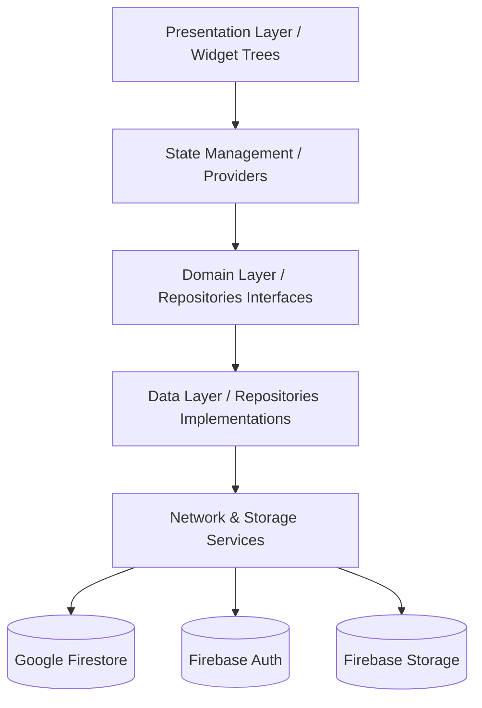

# FastCure Architectural Specifications

This document outlines the software engineering design patterns and architectural layers implemented within FastCure.

---

## 🏛️ Layered Architecture & Repository Pattern

FastCure is structured following clean architectural separation of concerns:

### 1. Presentation Layer (UI Views)
*   **Role**: Contains stateless/stateful Flutter widgets responsible for rendering premium Material 3 UI grids, tables, and dashboards.
*   **Design Rules**: Absolutely no direct Firestore queries or logic processing is allowed within UI files. The UI only listens to/triggers states inside the Providers.

### 2. State Management Layer (Providers)
*   **Role**: Extends ChangeNotifier to handle app state transitions (e.g. `isLoading`, `errorMessage`).
*   **Design Rules**: Communicates directly with Repository interfaces. Does not care about the underlying data source (whether Firestore, REST API, or Mock Databases).

### 3. Repository Layer (Domain/Data Separation)
*   **Role**: Interfaces define the contract (`doctor_repository.dart`), while implementations (`doctor_repository_impl.dart`) handle the exact calls to Firestore.
*   **Design Rules**: Translates raw Firebase exceptions into clean, localized warnings for the user.

### 4. Service Layer (Infrastructure Integrations)
*   **Role**: Houses singletons such as `FirebaseService` (initialization, FCM setups) and `AIService` (Gemini API calls).
